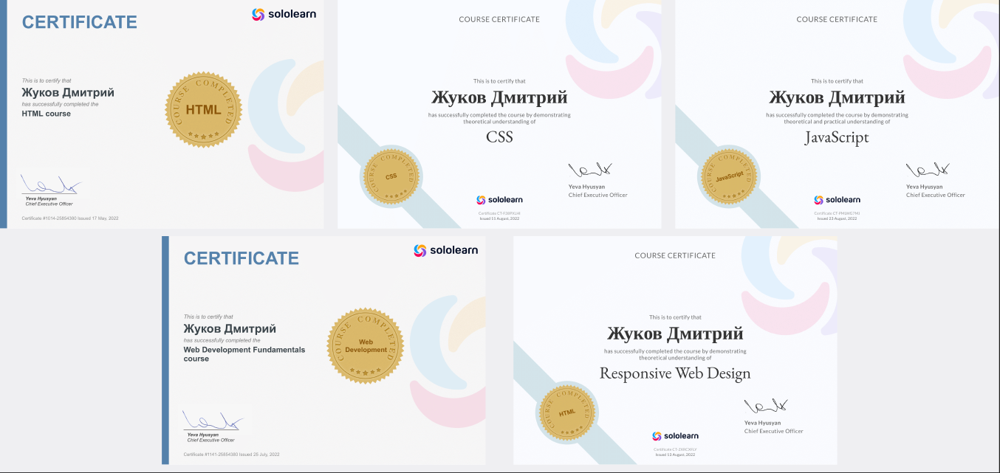
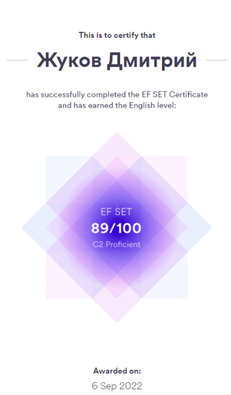

# ***Zhukov Dmitry***
## Junior Frontend Developer/Trainee
**************
## Contact information

* **Adress** Yerevan, Armenia
* **Phone** +374-91-277359
* **E-mail** [zhukontime](mailto:zhukontime@gmail.com "click to write me an E-mail")
* **Telegram** @zhukontime
* **GitHub** [@career404](https://github.com/Career404)

## About Me
**************
Hello! My name is Zhukov Dmitry, I was born and raised in Moscow,
Russia, and recently moved to Yerevan with my wife due to job
opportunity she recieved. 

Early in my life I made an uneducated decision to pursue a career
of a doctor. As an entry step to this profession I graduated from
a medical college with a nursing degree. After that I served as a
conscript in a largest military hospital of the national guard forces,
unfortunately losing faith in my career choice due to the state of
public health institutions in Russia.

My next job was health-related nonetheless - I became a lab
assistant in a private IVF Clinic. I learned laboratory techniques,
mostly those related to assisted reproduction, worked with biological
material and acquired a lot of experience developing and maintaining
tremendously large patient databases via Microsoft Excel and a
certain 1C-based system. I also created monthly and yearly reports,
including reports for Russian Association for Human Reproduction,
kept track of medical supplies, maintained lab equipment, took care
of all the paperwork in the lab, occasionally worked as an operating
nurse and in rare occasions consulted patients on lab techniques.

After 4.5 years of this "generalist" role I moved to a different country.
I am now certain about altering my career path towards IT, and front-end development to be precise. Creating eye-catching web-sites
to accentuate beatiful content and practical web-applications for
lifestyle and entertainment is fun!
## Skills
**************
* HTML5, CSS3, Less/SASS/SCSS
* Responsive web-design
* JavaScript
* Git, GitHub
* Basic SEO
## Code example
**************
*Latest solved kata on **Codewars**: returning the sum of all positive numbers in a given array*
```
function positiveSum(arr) {
  var newarr = arr.filter(positive);
  var sum = 0;
  for (let i=0; i<newarr.length; i++){
    sum += newarr[i];
  }
  return sum
}
function positive(x) {
  return x>=0
}
```
## Experience and projects
**************
* Wiki-like website (early phase)
* Drag-and-Drop web-application ([Mechwarrior 5 adaptation of this application](https://mwo.nav-alpha.com/mechlab))
* Little [multiplying windows](https://career404.github.io/click-create-html/) piece 
* <span title="*I was actually paid for this*">Fixing a Bootstrap-based website for a startup, added basic SEO tools </span> 
* ^this line is hoverable
## Education and courses
**************
<p align="center">

</p>

## Languages
***********
English - C2 Profecient
<p align="center">

</p>

Russian - Native
***********
